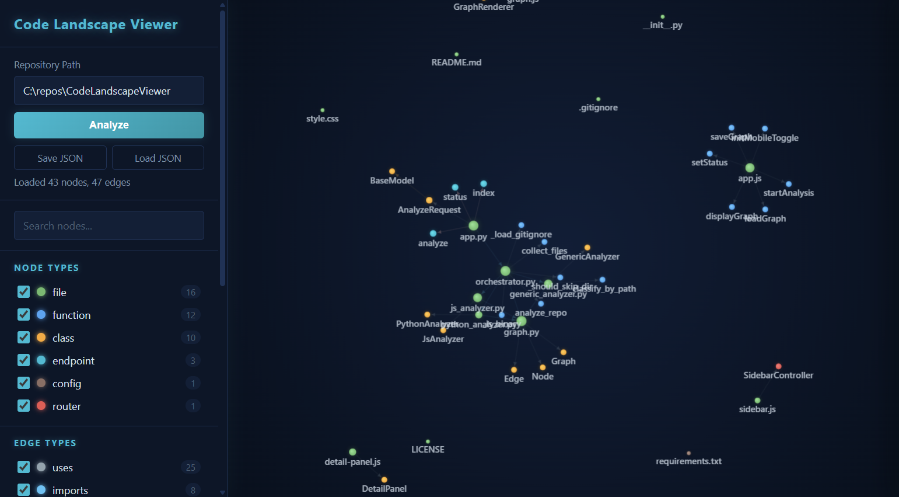
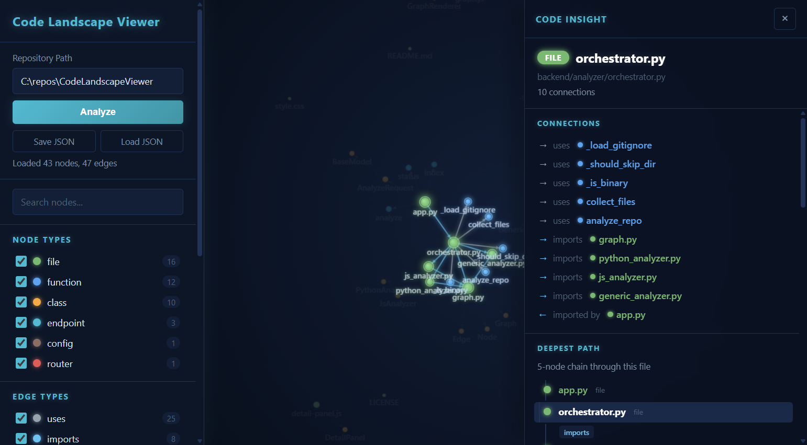

# Code Landscape Viewer

**Visualize any codebase as an interactive, navigable graph.** Point it at a repository and instantly see how files, classes, endpoints, models, and services connect -- across Python, JavaScript, TypeScript, and more.



Click any node to open the **Code Insight** panel -- a deep-dive view showing direct connections, full dependency chains, impact radius, and the deepest path through that node.



---

## What It Does

Code Landscape Viewer analyzes a code repository and produces a force-directed graph where every node is a meaningful code element (file, class, function, endpoint, model, service, task) and every edge is a real relationship (imports, calls, inheritance, DB operations, API calls).

Walk the graph interactively to understand how your code actually fits together.

### Key Features

- **Multi-language analysis** -- Python (AST-based), JavaScript/TypeScript (pattern-based), plus generic file-level analysis for any language
- **Semantic detection** -- identifies endpoints, models, routers, services, middleware, tasks, and more by analyzing decorators, base classes, and naming conventions
- **Relationship mapping** -- imports, function calls, inheritance, DB read/write, API calls, endpoint handlers
- **Interactive graph** -- D3.js force-directed layout with zoom, pan, drag, and canvas rendering for performance
- **Code Insight panel** -- click any node to see its connections, upstream/downstream dependency chains, impact radius, and deepest code path
- **Node & edge filtering** -- toggle visibility of any node type or edge type with a click
- **Search** -- find nodes by name or file path with instant highlighting
- **Save & load** -- export your analysis as JSON and share it with anyone, no code access required
- **Dark neon theme** -- glowing nodes, radial halos, and a futuristic aesthetic

### Supported Languages & Frameworks

| Language | Method | What It Detects |
|---|---|---|
| **Python** | AST parsing | Flask/FastAPI/Django endpoints, ORM models, Celery tasks, imports, class inheritance, DB operations |
| **JavaScript / TypeScript** | Pattern matching | Express/Koa routes, React components, Mongoose/Sequelize models, ES6/CommonJS imports, fetch/axios calls |
| **Any other language** | File-level analysis | Directory structure, file roles (test, config, route, model, service, utility), C/Go/Rust import patterns |

## Quick Start

### Prerequisites

- Python 3.10+
- pip

### Install

```bash
git clone https://github.com/glenwrhodes/CodeLandscapeViewer.git
cd CodeLandscapeViewer
pip install -r requirements.txt
```

### Run

```bash
cd backend
python -m uvicorn app:app --reload --port 8000
```

Open **http://localhost:8000** in your browser, enter a local repository path, and click **Analyze**.

## Usage

### Analyze a Repository

Enter any local path to a code repository and click **Analyze**. The tool walks the directory tree (respecting `.gitignore`), parses every file with the appropriate language analyzer, and renders the graph.

### Navigate the Graph

- **Zoom** -- scroll wheel
- **Pan** -- click and drag on empty space
- **Drag nodes** -- click and drag a node to reposition it
- **Click a node** -- highlights its connections and opens the Code Insight panel
- **Search** -- type in the search box to highlight matching nodes

### Code Insight Panel

Click any node to open the detail panel on the right, which shows:

- **Connections** -- every incoming and outgoing relationship, described in natural language ("imported by", "writes to DB", "extends")
- **Deepest Path** -- the longest chain through this node, rendered as a vertical timeline
- **Depends On** -- full upstream dependency tree
- **Depended On By** -- full downstream dependency tree
- **Impact Radius** -- how many nodes are affected if this one changes, grouped by distance

Every item in the panel is clickable -- click to jump to that node and explore further.

### Save & Share

Click **Save JSON** to download the analysis. Share the file with anyone -- they can click **Load JSON** to explore the graph without needing the source code.

### Display Options

- **Show Labels** -- toggle node name labels
- **Show Arrows** -- toggle directional arrows on edges
- **Freeze Layout** -- lock all nodes in place

## Architecture

```
CodeLandscapeViewer/
  backend/
    app.py                    # FastAPI app -- serves API + frontend
    analyzer/
      orchestrator.py         # Walks repo, routes to language analyzers
      graph.py                # Graph data model (nodes, edges, colors)
      python_analyzer.py      # Python AST-based analysis
      js_analyzer.py          # JS/TS regex-based analysis
      generic_analyzer.py     # File-level analysis for any language
  frontend/
    index.html                # Single-page app
    css/style.css             # Dark neon theme
    js/
      graph.js                # D3.js canvas graph renderer
      sidebar.js              # Filter controls
      detail-panel.js         # Code Insight panel with path-finding
      app.js                  # Main application wiring
```

**Backend**: FastAPI with a single `POST /api/analyze` endpoint. No database -- analysis is on-demand.

**Frontend**: Vanilla JS + D3.js. No build step, no npm, no framework. Just open and go.

## Contributing

Contributions are welcome. Some ideas:

- **New language analyzers** -- add support for Go, Rust, Java, C#, Ruby, etc.
- **Deeper analysis** -- track function call chains within files, detect design patterns
- **Cluster detection** -- automatically identify modules/subsystems
- **Export formats** -- SVG export, Mermaid diagram generation
- **Remote repos** -- analyze GitHub repos by URL without cloning

## License

[MIT](LICENSE)
